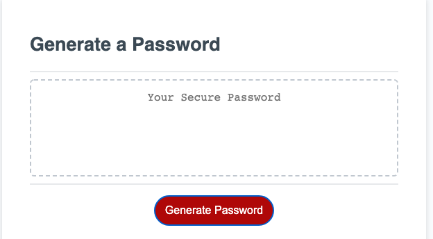

# Password_Generator

## Link to live Page

https://boopdid.github.io/Password_Generator/

## Overview

This is a password generator that takes lowercase, uppercase numbers and special characters to randomize a password between 8-128 characters.

## Preview

## Technologies used

-HTML
-CSS
-JavaScript

In this project i used my knowledge of JavaScript to make a password geneerator.
